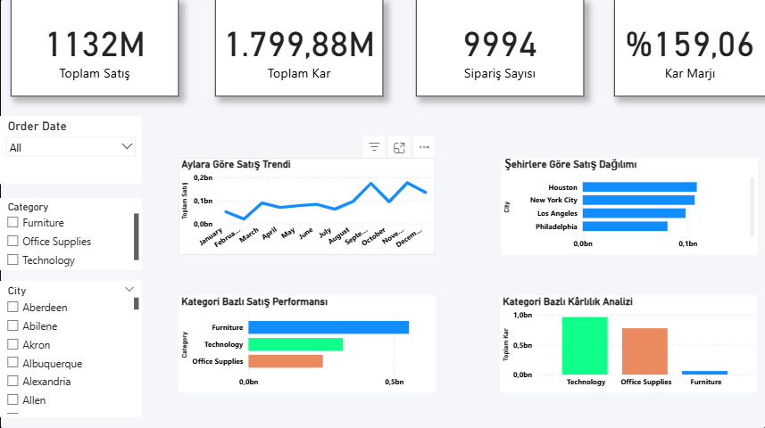

### Superstore Sales Analysis Dashboard (Power BI)

---

##  Dashboard Preview

---

##  Data Model View

### Proje Hakkında
Bu proje, Kaggle üzerinden alınan **Sample Superstore veri seti** kullanılarak Power BI üzerinde geliştirilmiştir.  
Amaç; satış performansını analiz etmek, kârlılığı incelemek ve veri üzerinden iş içgörüleri üretmektir.

---

##  Veri Seti Bilgisi

**Dataset:** Sample - Superstore (Kaggle)

### Kolonlar:
- Order ID
- Order Date
- Ship Date
- Customer ID
- Customer Name
- Segment
- Country
- City
- State
- Postal Code
- Region
- Product ID
- Category
- Sub-Category
- Sales
- Quantity
- Discount
- Profit

##  Kullanılan Araçlar
- Power BI
- Excel / CSV
- DAX (Measure oluşturma)
- Data Cleaning (Power Query)

  ###  Dashboard Yapısı

###  KPI Kartları
- Toplam Satış
- Toplam Kar
- Sipariş Sayısı
- Kar Marjı (%)

---

###  Kullanılan Grafikler

-  Aylara Göre Satış Trendi (Line Chart)
- Kategori Bazlı Satış Analizi (Bar Chart)
-  Şehir Bazlı Satış Dağılımı (Bar Chart)
-  Kategori Bazlı Kar Analizi (Column Chart)

###  Slicer (Filtreler)
- Order Date (Year / Month)
- Region
- Category
- Segment

---

### DAX Formülleri

## Toplam Satış = SUM('Sample - Superstore'[Sales])
## Toplam Kar = SUM('Sample - Superstore'[Profit])
## Sipariş Sayısı = COUNT('Sample - Superstore'[Order ID])
## Kar Marjı = DIVIDE(SUM('Sample - Superstore'[Profit]), SUM('Sample - Superstore'[Sales]))

### Insight (Analiz)

-Veri analizi sonucunda satış performansında hem zamansal hem de bölgesel bazda önemli farklılıklar gözlemlenmiştir.
-
Aylık satış trendi incelendiğinde belirli dönemlerde düşüşler ve dalgalanmalar olduğu görülmektedir. Bu durum talep değişimleri ve ürün performansıyla ilişkilidir.
-
Kategori bazlı analizde bazı ürün gruplarının toplam satış performansını aşağı çektiği, bazı kategorilerin ise yüksek katkı sağladığı tespit edilmiştir.
-
Şehir bazlı analizde satışların belirli bölgelerde yoğunlaştığı, bazı şehirlerde ise düşük performans görüldüğü ortaya çıkmıştır.
-
Genel olarak veri, satış performansının sadece toplam rakamlarla değil; kategori, bölge ve zaman kırılımlarında incelenmesi gerektiğini göstermektedir.
-

### Action (Aksiyon Önerileri)

Düşük performans gösteren kategoriler için ürün çeşitliliği ve fiyatlandırma stratejisi yeniden değerlendirilmelidir.
-
Satışların düşük olduğu şehirlerde pazarlama ve müşteri kazanım çalışmaları artırılmalıdır.
-
Yüksek satış yapan kategorilerde stok ve operasyon yönetimi güçlendirilmelidir.
-
Aylık düşüş yaşanan dönemler detaylı incelenerek sezonluk strateji oluşturulmalıdır.
-

- State
- Postal Code
